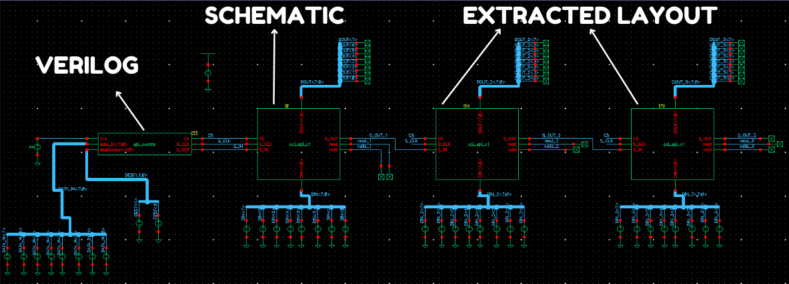

 
<h1> SPI Daysi Chain - Full Custom </h1>

## Description

<ul>
  <li>This repository contains a full-custom SPI Daisy-Chain slave module implementation. The logic cell layout was manually designed using <i>Virtuoso</i> and the Cadence <i>GPDK45</i> design kit.</li>
  <li>Routing was performed using the <i>Virtuoso</i> auto-routing feature.</li>
  <li>The test stimuli were generated using a Verilog module.</li>
</ul>

## Testbench and waveforms

  

 

  

 

  

 

  

                        
